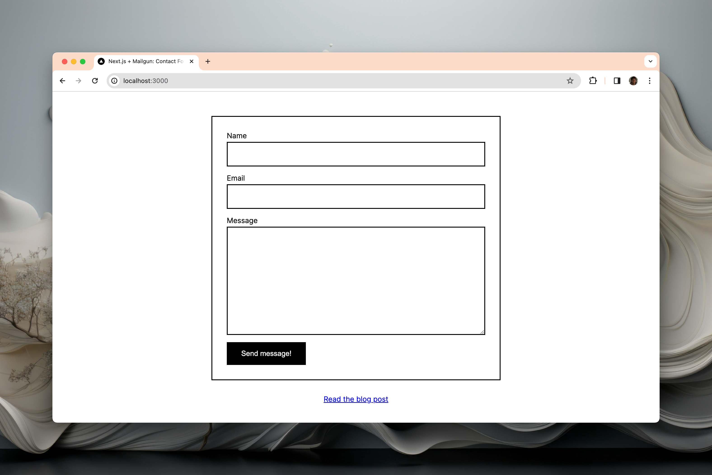

# Building a Contact Form with Next.js (Pages Router)



This is a [Next.js](https://nextjs.org/) project bootstrapped with [`create-next-app`](https://github.com/vercel/next.js/tree/canary/packages/create-next-app).

It was modified to showcase [how to add a contact form to a Next.js application](https://maxschmitt.me/posts/nextjs-contact-form), using [Mailgun](https://mailgun.com) to send emails.

## Getting Started

First, setup your environment variables:

```bash
cp .env.example .env.local
```

Add your own variables to `.env.local`.

Then, run the development server:

```bash
yarn dev
```

Open [http://localhost:3000](http://localhost:3000) with your browser to see the result.
